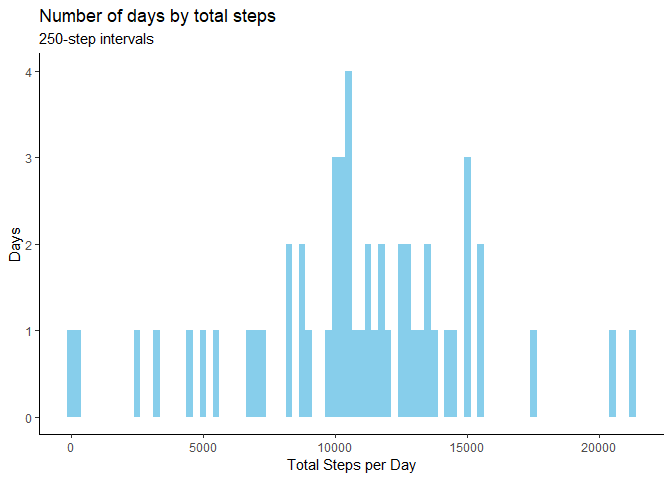
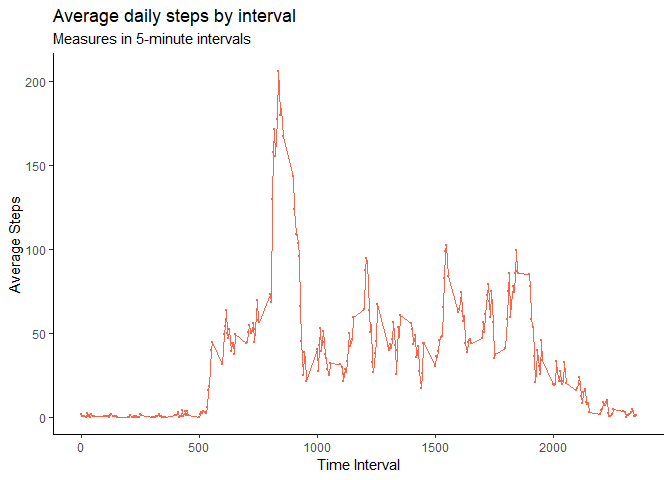
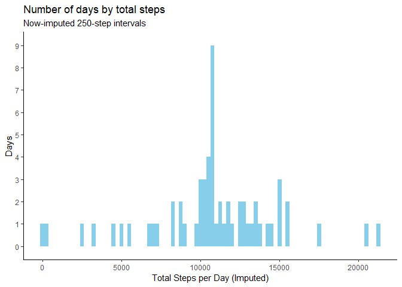
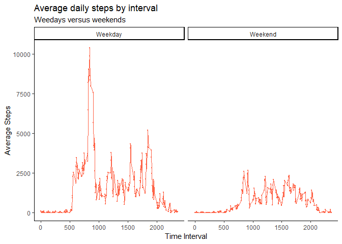

 
**Overview:** This analysis measures daily activity of an anonymous individual
in the spirit of the "Quantified Self" movement. All data were collected via a
personal activity monitoring device at 5-minute intervals throughout the day
over a 2-month period from October to November, 2012.
 
**Assignment:** *Peer-Graded Assignment: Course Project 1* is the first peer-
raded project of the "Reproducible Research" course, available on Coursera and 
authorized by Johns Hopkins University. The following steps are required in 
order to reproduce the analysis and fulfill submission requirements.
 
## Package Requirements

The following code chunk will detect and install missing packages, as well as
load required packages for the present analysis.


```r
if(!require(readr)){install.packages("readr")}
if(!require(dplyr)){install.packages("dplyr")}
if(!require(ggplot2)){install.packages("ggplot2")}

library(readr)
library(dplyr)
library(ggplot2)
```

## Loading and preprocessing the data

The following creates a directory to unzip, store, and read in the 
`activity.csv` dataset. The results are cached. 


```r
url <- "https://github.com/jamisoncrawford/RepData_PeerAssessment1/raw/master/activity.zip"
path <- "./activity_data"
file <- "./activity.zip"

if(!file.exists(path)){dir.create(path)}; setwd(path)
download.file(url, file); unzip(file)
activity <- read_csv("activity.csv")
rm(url, path, file)
```

## What is mean total number of steps taken per day?

The following histogram describes the count of `date` values during which the 
subject took a certain number of `steps`, in 250-step intervals. The mean and 
median of total daily `steps` are subsequently reported.


```r
daily <- activity %>%
    group_by(date) %>%
    summarize(total = sum(steps))

ggplot(daily, aes(total)) + 
    geom_histogram(binwidth = 250, fill = "skyblue") +
    ggtitle(label = "Number of days by total steps", 
            "250-step intervals") +
    xlab("Total Steps per Day") +
    ylab("Days") +
    theme_classic()
```

<!-- -->

```r
daily %>% 
    summarize(`Mean Total Steps` = mean(total, na.rm = TRUE),
              `Median Total Steps` = median(total, na.rm = TRUE)) %>%
    as.data.frame
```

```
##   Mean Total Steps Median Total Steps
## 1         10766.19              10765
```

## What is the average daily activity pattern?

The following time series graphic depicts the average number of steps for each
`interval` across all `date` values. The subsequent output reports the 
`interval` with the maximum daily `steps`. 


```r
activity %>%
    group_by(interval) %>%
    summarize(mean = mean(steps, na.rm = TRUE)) %>%
    ggplot(aes(x = interval, y = mean)) +
    geom_point(cex = 0.25, color = "tomato") +
    geom_line(color = "tomato") +
    ggtitle("Average daily steps by interval",
            "Measures in 5-minute intervals") +
    ylab("Average Steps") +
    xlab("Time Interval") +
    theme_classic()
```

<!-- -->

```r
daily <- activity %>%
    group_by(interval) %>%
    summarize(mean = mean(steps, na.rm = TRUE))
                  
daily %>% 
    summarize(`Interval with Max Steps` = daily$interval[which.max(mean)]) %>% 
    as.data.frame
```

```
##   Interval with Max Steps
## 1                     835
```

## Imputing missing values

The following reports the total `NA` (missing) values within `activity.csv`.
Missing `interval` values are imputed by replacing each with the mean number of
`steps` per `interval` over all `date` values. The new dataset, `imputed`
contains the original `activity.csv` data with `NA` values imputed. The
subsequent histogram depicts the total `steps` for each `date` using the new
`imputed` dataset and, lastly, reports mean and median total `steps` per `date`.


```r
paste("There are", sum(is.na(activity$steps)), "missing values.", sep = " ")
```

```
## [1] "There are 2304 missing values."
```

```r
imputation <- activity %>%
    group_by(interval) %>%
    summarize(interval_mean = mean(steps, na.rm = TRUE))

imputed <- as_data_frame(activity)

for (i in seq_along(imputed$steps)){
    if (is.na(imputed$steps[i])){
        imputed$steps[i] <- round(imputation[which( imputed$interval[i] == imputation$interval ), 2], 0)}}

imputed$steps <- unlist(imputed$steps)

daily <- imputed %>% 
    group_by(date) %>%
    summarize(total = sum(steps))

daily %>%
    summarize(`Mean Total Steps (Imputed)` = mean(total, na.rm = TRUE),
              `Median Total Steps (Imputed)` = median(total, na.rm = TRUE)) %>%
    as.data.frame
```

```
##   Mean Total Steps (Imputed) Median Total Steps (Imputed)
## 1                   10765.64                        10762
```

```r
ggplot(daily, aes(total)) + 
    geom_histogram(binwidth = 250, fill = "skyblue") +
    ggtitle(label = "Number of days by total steps", 
            "Now-imputed 250-step intervals") +
    xlab("Total Steps per Day (Imputed)") +
    ylab("Days") +
    scale_y_discrete(limits = c(0:9)) +
    theme_classic()
```

<!-- -->

**Conclusions:** One can see that imputed missing values in `activity.csv` 
has had a negligible impact on `Mean Total Steps` and `Median Total Steps`. The 
histogram, however, depicts significantly more `date` values.

## Are there differences in activity patterns between weekdays and weekends?

The following uses `date` to create a factor, `day`, with two levels: `Weekday`
and `Weekend`. The latticed time series below depicts the difference in mean
`steps` values between `Weekday` and `Weekend`, determined with the average
`steps` value over all `date` values and by `interval`. 


```r
imputed$day <- weekdays(imputed$date)
weekdays <- c("Monday", "Tuesday", "Wednesday", "Thursday", "Friday")
imputed$day <- c('Weekend', 'Weekday')[(imputed$day %in% weekdays) + 1L]
intervals <- imputed %>%
    group_by(day, interval) %>%
    summarize(steps = mean(sum(steps), na.rm = TRUE))

ggplot(intervals, aes(x = interval, y = steps)) +
    geom_point(cex = 0.25, color = "tomato") +
    geom_line(color = "tomato") +
    ggtitle("Average daily steps by interval",
            "Weedays versus weekends") +
    ylab("Average Steps") +
    xlab("Time Interval") +
    theme_classic() +
    facet_wrap(~day)
```

<!-- -->
